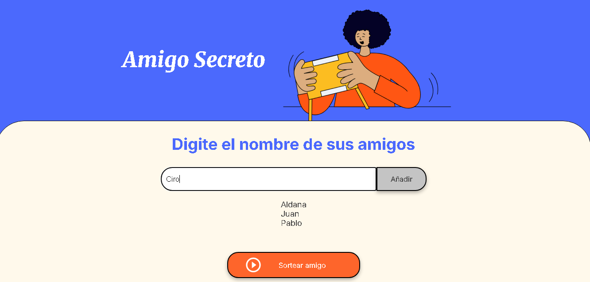
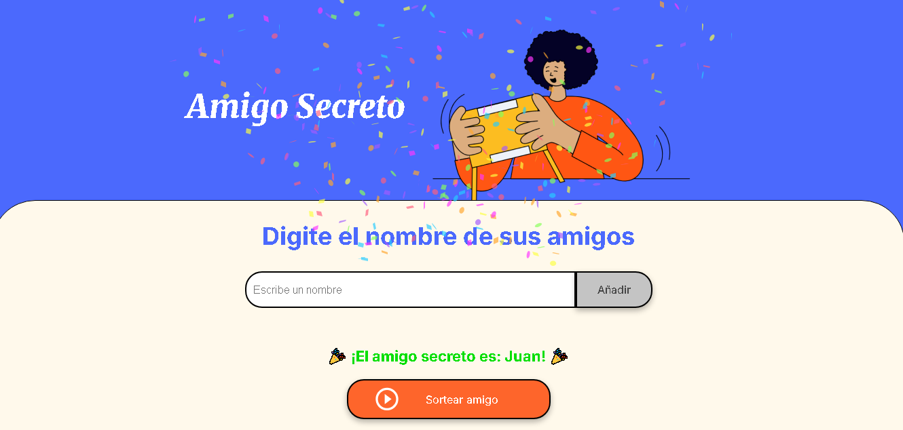

# Amigo Secreto 🎉

Este proyecto es una aplicación sencilla en JavaScript para realizar el sorteo de un "amigo secreto".
Permite a los usuarios agregar nombres a una lista y sortear aleatoriamente un amigo secreto.

## 🖼 Capturas de pantalla

<div align="center">

Ingreso de nombres y lista de amigos:



Sorteo con suspenso y confeti:



</div>

## ⚙️ Funciones
- **Agregar amigos a la lista** con validación de caracteres y longitud mínima.

- **Capitalización automática** de nombres.

- **Sorteo con suspenso**, mostrando los nombres en rápida sucesión antes de revelar al ganador.

- **Confeti y sonido** al anunciar al ganador.

- **Reinicio automático** de la lista después del sorteo.

- **Sporte de teclado**: presionar Enter agrega un amigo a la lista.

## 🚀 Instalación
1. Clona este repositorio o descarga el proyecto.
- Desde GitHub:
```bash
git clone https://github.com/tu-usuario/proyecto-amigo-secreto.git
```
- O descargar el ZIP del repositorio y descomprimirlo en tu computadora.

2. Abre el archivo `index.html` en tu navegador.
- Entrar a la carpeta del proyecto y abrir index.html en cualquier navegador moderno (Chrome, Firefox, Edge, etc.).

## 📌 ¿Cómo usar?
1.**Agregar amigos**

- Escribir el nombre en el campo de texto "Escribe un nombre".

- Se validan los nombres: solo letras, mínimo 3 caracteres y no repetidos.

2.**Realizar un sorteo**

- Una vez que haya al menos 2 nombres, hacer clic en Sortear.

- Aparecerá la animación de “ruleta” con los nombres cambiando rápidamente.

- Sonará un tambor de suspenso mientras gira la ruleta.

- Tras unos segundos, se mostrará el ganador con confeti.

3.**Reinicio automático**

- Después de mostrar el ganador, la lista se reinicia automáticamente para un nuevo sorteo.

## ⚙️ Requisitos
- Navegador actualizado (Chrome, Firefox, Edge, etc.).

- Conexión a Internet no necesaria (el proyecto funciona de forma local)

## 🛠 Tecnologías utilizadas

- HTML

- CSS

- JavaScript (DOM, eventos, setInterval, setTimeout)

- [canvas-confetti](https://www.npmjs.com/package/canvas-confetti)(para animaciones de confeti)

## Autor
- [Github](https://github.com/Piojo13)